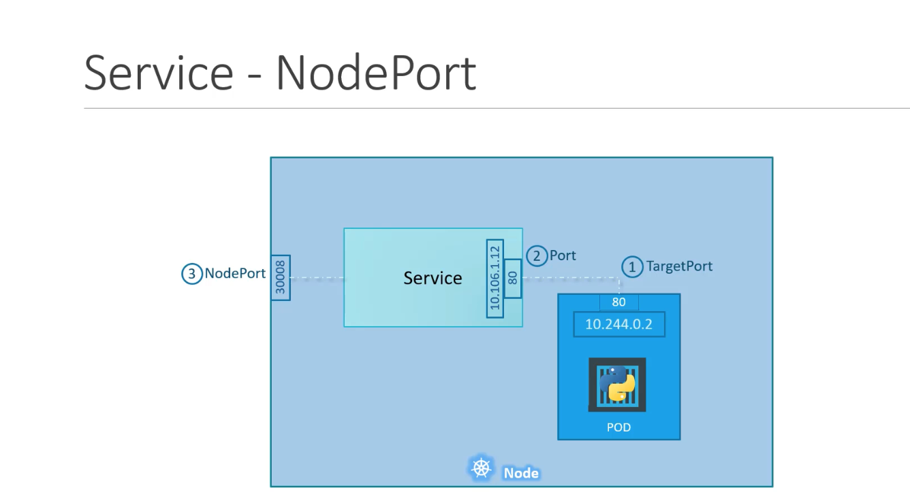
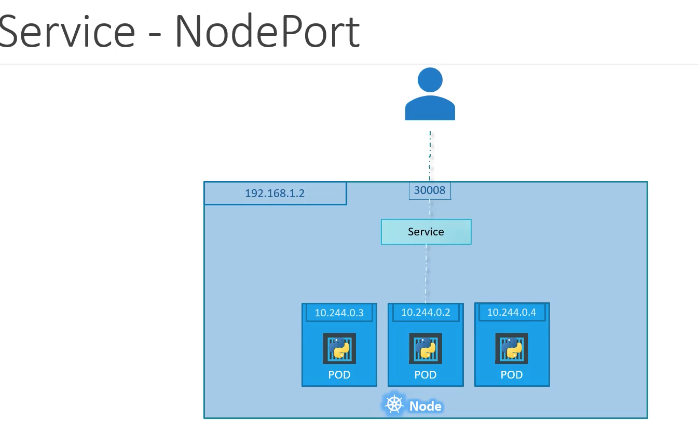

# 🐳 Kubernetes Quick Commands

This guide provides common Kubernetes commands for working with pods.

---

## 📘 Get Pods in Namespace

Use the following command to list all pods within a specific Kubernetes namespace.

### 🔧 Command

```bash
kubectl get pods -n <namespace>
```

## 🛠️ Use the `kubectl run` Command with the Correct Image

To launch a pod using a specific container image, use the `kubectl run` command followed by the pod name and the `--image` flag.

### 🔧 Command

```bash
kubectl run <pod-name> --image=<image-name>
```

### 🔧 Describe pod by id to get info about image...

## 🛠️ Use the `kubectl describe` with the correct pod name and pod id
```bash
kubectl describe pod podname-<id>
```

### 🔧 Delete a pod

## 🛠️ Use the `kubectl delete pod` 
```bash
kubectl delete pod podname
```

### 🔧 Create a new pod with the name redis and the image redis123

## 🛠️ We use `kubectl run` command with `--dry-run=client -o yaml` option to create a manifest file
```bash
kubectl run redis --image=redis123 --dry-run=client -o yaml > redis-definition.yaml
```

## 🛠️ After that, using `kubectl create -f` command to create a resource from the manifest file
```bash
kubectl create -f redis-definition.yaml
```

### 🔧 Change the image on a given pod

## 🛠️ We use `kubectl edit` command to update the image on a given pod
```bash
kubectl edit pod redis
```

## 🛠️ If you used a pod definition file then update the image from redis123 to redis in the definition file
via Vi or Nano editor and then run kubectl apply command to update the image:
```bash
kubectl apply -f redis-definition.yaml
```

## 📘 Get replicasets in Namespace

Use the following command to list all pods within a specific Kubernetes namespace.

### 🔧 Command

```bash
kubectl get replicaset
```

```bash
kubectl run <pod-name> --image=<image-name>
```

### 🔧 Describe replicaset

## 🛠️ Use the `kubectl describe` with the correct pod name and pod id
```bash
kubectl kubectl describe replicaset
```

### 🔧 Fix error in replicaset yml

## 🛠️ Open with nano or vim
```bash
nano /root/replicaset-definition-1.yaml
```

## 🛠️ Apply changes
```bash
kubectl apply -f /root/replicaset-definition-1.yaml
```


### 🔧 scale up replicaset

## 🛠️ Open and edit
```bash
kubectl edit rs new-replica-set
```

## 📘 Get all objects (pods, replicasets and deployments) in Namespace


### 🔧 Command

```bash
kubectl get all
```

## 📘 Get info about the deployment object


### 🔧 Use `kubectl describe deployment` command

```bash
kubectl kubectl describe deployment
```

### 🔧 Fix error in deployment yml

## 🛠️ Open with nano or vim
```bash
vim /root/deployment-definition-1.yaml
```

## 🛠️ Apply changes
```bash
kubectl apply -f /root/deployment-definition-1.yaml
```

### 🔧 Create a new Deployment needed attributes using your own deployment definition file.

## 🛠️ Create a deployment.ytm file with the needed attributes
```bash
kubectl create deployment httpd-frontend --image=httpd:2.4-alpine --replicas=3 -o yaml > deployment.yaml
```

## 🛠️ Apply changes
```bash
kubectl apply -f deployment.yaml
```

### 🔧 Create a new Deployment using kubectl directly
```bash
kubectl create deployment httpd-frontend --image=httpd:2.4-alpine
kubectl scale deployment httpd-frontend --replicas=3
```


## 📘 Get Namespace

### 🔧 Command

```bash
kubectl get namespace
```

## 📘 Get pods in a given namespace

### 🔧 Command

```bash
kubectl get pods --namespace=research
```

## 📘 Get pods in all namespaces

### 🔧 Command

```bash
kubectl get pods --all-namespaces
```


## 📘 Create a pod (redis) in a given namespace (finance)

### 🔧 Command

```bash
kubectl run redis --image=redis -n finance
```


## 🛠️ Set Environment Variables

You can define environment variables for containers using the `env` field inside the `spec.containers` section of a Pod YAML:

```yaml
spec:
  containers:
    - name: my-container
      image: ubuntu
      command: ["sleep"]
      args: ["3600"]
      env:
        - name: MY_VAR
          value: "Hello world"
```

# Understanding `ENTRYPOINT` and `CMD` in Docker vs `command` and `args` in Kubernetes

### In Docker:

- **`ENTRYPOINT`** — defines the **main executable** that always runs.
- **`CMD`** — provides the **default arguments** to that executable.

When you run a container, Docker combines them like this:

```bash
ENTRYPOINT + CMD
```

### Example Dockerfile:

ENTRYPOINT ["sleep"]
CMD ["10"]

Running this container is equivalent to:

sleep 10

**In Kubernetes:

    command corresponds to Docker's ENTRYPOINT — the executable to run.

    args corresponds to Docker's CMD — the arguments passed to the executable.

Example Pod spec snippet:

command: ["sleep"]
args: ["10"]

Kubernetes runs:

sleep 10

### Why is this useful 

Why is this useful?

    You can override the default command or args without changing the container image.

    For example, if your container image runs a web server by default, but for debugging you want to run a shell instead, you can override the command to ["/bin/sh"].

    Or if your container runs a script with default args, you can change just the args for different behavior.

## 🔐 Set Environment Variables from ConfigMap and Secret

Kubernetes allows you to set environment variables in a pod dynamically using values from a `ConfigMap` or a `Secret`. This is done using the `valueFrom` field in the container's `env` section.

### 📦 From a ConfigMap

To use a value from a `ConfigMap`, use the `configMapKeyRef` field:

```yaml
spec:
  containers:
    - name: my-container
      image: ubuntu
      command: ["sleep"]
      args: ["3600"]
      env:
        - name: CONFIG_VAR
          valueFrom:
            configMapKeyRef:
              name: my-config         # Name of the ConfigMap
              key: config-key         # Key to fetch the value from
```

A volume in a Kubernetes Pod is a way to provide persistent or shared storage to containers within the Pod. Unlike the container’s local filesystem (which is ephemeral and wiped out when the container restarts), volumes are designed to persist data across container restarts or be shared between containers in the same Pod.
📦 What Is a Volume?

    Definition: A volume is a directory accessible to the containers in a Pod, backed by a storage medium like a local disk, cloud disk, secret, config, etc.

🧠 Why Use Volumes?

    Share data between containers in a Pod.

    Persist data across container restarts (though not across Pod restarts unless using persistent volumes).

    Mount secrets or config files as files.

    Mount external storage (like NFS, AWS EBS, etc.).

# 🔐 Using Kubernetes Secrets in Pods

Kubernetes **Secrets** let you store and manage sensitive information such as passwords, tokens, or SSH keys. They help protect this data from being exposed in container specs or images.

---

## 📘 Official Docs

Refer to the official Kubernetes documentation:  
[Secrets | Kubernetes](https://kubernetes.io/docs/concepts/configuration/secret/)

---

## 🧾 What is a Secret?

A `Secret` is a Kubernetes object used to hold sensitive information. Types include:

- `Opaque` (default): Arbitrary key-value pairs
- `kubernetes.io/basic-auth`
- `kubernetes.io/dockerconfigjson`
- `kubernetes.io/tls`

---

## 🛠️ Creating a Secret

### Using `kubectl`:

```bash
kubectl create secret generic my-secret \
  --from-literal=username=admin \
  --from-literal=password='1f2d1e2e67df'
```

### Using YAML

```yaml
apiVersion: v1
kind: Secret
metadata:
  name: my-secret
type: Opaque
data:
  username: YWRtaW4=        # base64 for "admin"
  password: MWYyZDFlMmU2N2Rm # base64 for "1f2d1e2e67df"
```

### Inject a Secret as a Volume:

Create the secret via `kubectl:

```bash
  kubectl create secret generic my-secret \
  --from-literal=username=admin \
  --from-literal=password='s3cr3t'

```

Use yml

```yaml
apiVersion: v1
kind: Pod
metadata:
  name: secret-volume-pod
spec:
  containers:
    - name: app-container
      image: busybox
      command: ["sh", "-c", "cat /etc/secrets/username && cat /etc/secrets/password"]
      volumeMounts:
        - name: secret-volume
          mountPath: "/etc/secrets"
          readOnly: true
  volumes:
    - name: secret-volume
      secret:
        secretName: my-secret
```

Apply with 
```bash 
  kubectl apply -f my-secret.yaml
```

Result in Container Filesystem

Once mounted, the contents of the secret are available as individual files:

`/etc/secrets/username   → contains: admin`

`/etc/secrets/password   → contains: s3cr3t`


# 🔐 Using Service Accounts in Kubernetes Pods

A **ServiceAccount** in Kubernetes is an identity assigned to a Pod to authenticate with the Kubernetes API server. You can use it to control what a Pod is allowed to do using **RBAC (Role-Based Access Control)**.

---

## 📘 Official Docs

- [Service Accounts | Kubernetes](https://kubernetes.io/docs/tasks/configure-pod-container/configure-service-account/)
- [Using RBAC Authorization](https://kubernetes.io/docs/reference/access-authn-authz/rbac/)

---

## 🧾 What Is a Service Account?

- Automatically used by Pods to access the Kubernetes API.
- By default, every namespace has a `default` service account.
- You can create custom service accounts with specific permissions.

---

## 🛠️ Creating a Service Account

```yaml
apiVersion: v1
kind: ServiceAccount
metadata:
  name: my-service-account
```

# 🔐 Using a ServiceAccount Token in a Pod

This example shows how to create a Kubernetes `ServiceAccount`, request a token, and mount it into a Pod so your application can authenticate to the Kubernetes API or other services using that token.

---

## 🛠 Step 1: Create a ServiceAccount

```yaml
apiVersion: v1
kind: ServiceAccount
metadata:
  name: app-service-account
```

## 🧾 Step 2: Generate a Token (Optional – for external apps)

If you're running your app outside the cluster, use this command to generate a token using the TokenRequest API (Kubernetes v1.24+):

`kubectl create token app-service-account`

You can use this token in any external app by setting the Authorization: Bearer <token> header.

##📦 Step 3: Mount the Token into a Pod

The ServiceAccount token will automatically be mounted at:
`/var/run/secrets/kubernetes.io/serviceaccount/token`

```yaml
apiVersion: v1
kind: Pod
metadata:
  name: app-using-sa
spec:
  serviceAccountName: app-service-account
  containers:
    - name: myapp
      image: curlimages/curl
      command: ["sh", "-c"]
      args:
        - |
          echo "Using token to access API"
          TOKEN=$(cat /var/run/secrets/kubernetes.io/serviceaccount/token)
          curl -s --cacert /var/run/secrets/kubernetes.io/serviceaccount/ca.crt \
            -H "Authorization: Bearer $TOKEN" \
            https://kubernetes.default.svc/api
```

🔐 Notes

    Kubernetes mounts the token and CA cert automatically when you assign a serviceAccountName.

    You can control whether the token is mounted using:

`automountServiceAccountToken: false`

    The API server URL inside a cluster is always:
    https://kubernetes.default.svc

✅ Use Cases

    Custom applications that interact with the Kubernetes API

    Controllers, operators, or sidecars needing access

    Secure service-to-service authentication


## 🔐 Exploring the Default ServiceAccount in Kubernetes Pods for kubernetes < v1.24,

Kubernetes automatically assigns a **ServiceAccount** to every Pod. If you don’t explicitly specify one, the **`default` ServiceAccount** in the Pod’s namespace is used.

---

## ✅ What Gets Mounted Into the Pod?

When a Pod is created, Kubernetes automatically mounts the following files at:

`/var/run/secrets/kubernetes.io/serviceaccount/`


These include:

| File        | Purpose                                                      |
|-------------|--------------------------------------------------------------|
| `token`     | JWT token used to authenticate to the Kubernetes API         |
| `ca.crt`    | Cluster CA certificate for verifying the API server's identity |
| `namespace` | The namespace the Pod is running in                          |

---

## 🧪 Demo: Inspecting the ServiceAccount Files Inside a Pod

### 📄 Pod Definition (`pod-definition.yml`)

```yaml
apiVersion: v1
kind: Pod
metadata:
  name: my-kubernetes-dashboard
spec:
  containers:
    - name: my-kubernetes-dashboard
      image: my-kubernetes-dashboard
```

📌 Commands to Run

    Create the Pod:

`kubectl create -f pod-definition.yml`

Check the available ServiceAccounts in the namespace:

`kubectl get serviceaccount`

You should see something like:

NAME      SECRETS   AGE
default   1         5d

Describe the Pod to see which ServiceAccount is used:

`kubectl describe pod my-kubernetes-dashboard`

Look for the Service Account: and the automatically mounted volume under Volumes.

Inspect the mounted ServiceAccount files inside the Pod:

`kubectl exec -it my-kubernetes-dashboard -- ls /var/run/secrets/kubernetes.io/serviceaccount`

Expected output:

    ca.crt
    namespace
    token

🔍 Why This Is Useful

    No manual setup is needed to use a ServiceAccount token inside a Pod.

    This token can be used by applications (e.g., Prometheus, Vault, custom controllers) to securely authenticate to the Kubernetes API.

    Kubernetes automatically rotates and manages this token.

🔐 Default ServiceAccount Permissions

The default ServiceAccount is intentionally very limited:

    It only has permissions to make basic Kubernetes API requests, such as:

        Reading information about itself

        Basic access to the namespace it's running in

⚠️ It cannot:

    List or modify Pods, Nodes, or Secrets

    Access resources across namespaces

    Perform actions like create/delete/update resources

If your application needs additional permissions, you should:

    Create a custom ServiceAccount

    Use RBAC (Role + RoleBinding) to assign only the permissions it needs

    Reference it using serviceAccountName: in the Pod or Deployment spec

🛡️ Security Note

Always follow the principle of least privilege:

    Use the default ServiceAccount for basic apps that don’t need API access.

    Use custom ServiceAccounts with RBAC for anything else.

🔍 automountServiceAccountToken: false

This disables Kubernetes' default behavior of automatically mounting the service account token at:

`/var/run/secrets/kubernetes.io/serviceaccount/token`

Use this when:

    The app does not need to talk to the Kubernetes API

    You want to reduce the Pod's permissions surface

    You use an external method for secrets or credentials (e.g., Vault, OIDC, etc.)


# 🔐 Kubernetes ServiceAccounts, Tokens, and Pod Authentication (v1.24+)

This guide explains how ServiceAccounts and tokens work in modern Kubernetes (v1.24+), including how to assign them to Pods, disable auto-mounting, and use the TokenRequest API for secure, short-lived tokens.

---

## 📌 Key Changes Since Kubernetes v1.24

| Feature                                 | Before v1.24       | v1.24 and Later              |
|----------------------------------------|--------------------|------------------------------|
| Token stored as Secret                 | ✅ Yes             | ❌ No                        |
| Token auto-generated for every SA      | ✅ Yes             | ❌ No                        |
| Token mounted in Pod                   | ✅ Yes (static)    | ✅ Yes (projected, short-lived) |
| Token lifetime                         | 🔁 Infinite        | ⏱️ Configurable (e.g., 1h)     |
| Token audience scope                   | ❌ No              | ✅ Yes                        |

---

## 📦 Default ServiceAccount Behavior

Every Kubernetes **namespace** has a `default` ServiceAccount.

When a Pod is created without specifying a `serviceAccountName`, Kubernetes:

- Automatically assigns the `default` ServiceAccount
- Automatically **projects a short-lived token** into the Pod at:

`/var/run/secrets/kubernetes.io/serviceaccount/token`


You can inspect this with:

```bash
kubectl exec -it <pod-name> -- ls /var/run/secrets/kubernetes.io/serviceaccount
```
Output:

ca.crt
namespace
token

✅ Using a Custom ServiceAccount in a Pod
1. Create a ServiceAccount

```yml
apiVersion: v1
kind: ServiceAccount
metadata:
  name: dashboard-sa
```
`kubectl apply -f service-account.yaml`

2. Assign It to a Pod

```yaml
apiVersion: v1
kind: Pod
metadata:
  name: my-kubernetes-dashboard
spec:
  serviceAccountName: dashboard-sa
  containers:
    - name: my-kubernetes-dashboard
      image: my-kubernetes-dashboard
```      

    The token will automatically be projected using the TokenRequest API. No volume mounts needed.

3. (Optional) Disable Auto-Mounting the Token

If your app does not need to access the Kubernetes API, you can disable the token mount:

```yaml
spec:
  serviceAccountName: dashboard-sa
  automountServiceAccountToken: false
```


4. Add RBAC Permissions (If API Access Is Needed)

```yaml
apiVersion: rbac.authorization.k8s.io/v1
kind: Role
metadata:
  name: dashboard-read-pods
rules:
  - apiGroups: [""]
    resources: ["pods"]
    verbs: ["get", "list", "watch"]
---
apiVersion: rbac.authorization.k8s.io/v1
kind: RoleBinding
metadata:
  name: dashboard-read-pods-binding
subjects:
  - kind: ServiceAccount
    name: dashboard-sa
    namespace: default
roleRef:
  kind: Role
  name: dashboard-read-pods
  apiGroup: rbac.authorization.k8s.io
```
🔑 Accessing the API Using the Mounted Token

From inside the Pod:

`TOKEN=$(cat /var/run/secrets/kubernetes.io/serviceaccount/token)`
`curl -s --cacert /var/run/secrets/kubernetes.io/serviceaccount/ca.crt \
  -H "Authorization: Bearer $TOKEN" \
  https://kubernetes.default.svc/api`

🔄 On-Demand Token via kubectl (v1.24+)

If you need a token for an external app (not inside a Pod), generate a short-lived token like this:

kubectl create token dashboard-sa

You can use this token for Kubernetes API access with scoped audiences and expiry.


`kubectl get pod my-kubernetes-dashboard -o yaml`


## 📥 What You’re Seeing: Token Projection Instead of Secret

In Kubernetes v1.24+, when you inspect a Pod’s YAML, you no longer see a Secret mounted for the service account token.
🔍 Instead, you’ll see something like this under volumes:

```yaml
volumes:
  - name: kube-api-access-<random>
    projected:
      sources:
        - serviceAccountToken:
            audience: kubernetes.default.svc
            expirationSeconds: 3607
            path: token
```            

This is called a projected volume, and it's powered by the TokenRequest API.
###🔑 What This Means

    The token is no longer stored in a Secret (kubectl get secret won’t show it).

    Kubernetes generates a short-lived, audience-scoped token on demand when the Pod starts.

    This token is projected into the Pod using the TokenRequest API.

    It is mounted at:

    `/var/run/secrets/kubernetes.io/serviceaccount/token`

So your Pod still gets a token — but it’s securely managed, ephemeral, and not visible through kubectl get secret.
📌 Example: What You’ll See in `kubectl get pod -o yaml`

```yaml
serviceAccountName: default
automountServiceAccountToken: true
volumes:
  - name: kube-api-access-4vghz
    projected:
      sources:
        - serviceAccountToken:
            expirationSeconds: 3607
            path: token
            audience: kubernetes.default.svc
 ```           

✅ TL;DR
Feature	Pre v1.24	v1.24+
Token stored as Secret	✅ Yes	❌ No
Pod references the token Secret	✅ Yes	❌ No (uses projected volume instead)
Pod still receives a token	✅ Yes	✅ Yes (via TokenRequest API)
Token lifetime	🔁 Infinite	⏱️ Short-lived (~1hr default)

✅ Summary
Step	Task
1	Create a custom ServiceAccount
2	Assign it to your Pod using serviceAccountName
3	(Optional) Disable token mounting if not needed
4	Grant RBAC permissions if API access is required
5	Use kubectl create token for external apps
🛡️ Best Practices

    Do not rely on legacy Secrets for tokens — they’re deprecated.

    Always use short-lived, projected tokens.

    Disable automountServiceAccountToken unless the token is needed.

    Use least privilege RBAC when assigning roles.

    Set token audience and expiration when using TokenRequest API.

# 🏷️ Labels, Selectors, and Annotations in Kubernetes

Kubernetes uses **labels**, **selectors**, and **annotations** to organize, filter, and manage resources.

---

## 🏷️ Labels

Labels are key-value pairs used to categorize and group Kubernetes objects. They are commonly used in selectors for Services, Deployments, and `kubectl` queries.

### 📌 Common Labeling Strategy

| Label     | Purpose                                 | Example         |
|-----------|------------------------------------------|-----------------|
| `app`     | Identifies the application/component     | `app: nginx`    |
| `function`| Describes the role or functional purpose | `function: web` |

### 🔧 Example Pod with Labels

```yaml
apiVersion: v1
kind: Pod
metadata:
  name: my-app
  labels:
    app: nginx
    function: web
spec:
  containers:
    - name: nginx
      image: nginx
```      

🎯 Label Selectors

Selectors allow you to filter and match resources based on their labels.
They are commonly used in:

    Services (to select Pods)

    ReplicaSets, Deployments

    kubectl commands

🔍 Types of Selectors
1. Equality-based Selectors

Selects resources that match an exact value.

```yaml
selector:
  matchLabels:
    app: nginx
    function: web
```


This selects resources with the label: app=web.
2. Set-based Selectors

Allows complex selection using in, notin, and exists.

```yaml
selector:
  matchExpressions:
    - key: env
      operator: In
      values: [production, staging]
```      

💡 Example: Service Selecting Pods

```yaml
apiVersion: v1
kind: Service
metadata:
  name: my-service
spec:
  selector:
    app: web
  ports:
    - port: 80
      targetPort: 8080
```
This service will send traffic to Pods with the label app=web.
📝 Annotations

Annotations are also key-value pairs, but unlike labels:

    They are not used for selection or filtering.

    They store arbitrary metadata (often used by tools or controllers).

    Used for non-identifying info like:

        Build version

        Documentation links

        Monitoring config

        External tooling (e.g., kubectl.kubernetes.io/last-applied-configuration)

🔧 Example

```yaml
apiVersion: v1
kind: Pod
metadata:
  name: annotated-pod
  annotations:
    description: "This pod runs the web frontend"
    contact: "team@example.com"
spec:
  containers:
    - name: nginx
      image: nginx
```      

🧠 Labels vs Annotations
Feature	Labels	Annotations
Used for	Selection, grouping	Metadata, tooling info
Filterable	✅ Yes	❌ No
Max size	Small (limited in number/size)	Larger, for long text or blobs
CLI use	Used in kubectl get, kubectl delete, etc.	Mostly informational
✅ Best Practices

    Use labels to organize and query objects (e.g., by app, tier, environment).

    Use annotations to store metadata or integration data (e.g., Prometheus scrape configs, last applied state).

    Prefer matchLabels for simple selectors and matchExpressions for complex logic.

📌 Bonus: Querying with kubectl

# Get all pods with label app=web
`kubectl get pods -l app=web`

# Get all resources with label env=prod
`kubectl get all -l env=prod`

# Show labels on all pods
`kubectl get pods --show-labels`


💻 Useful kubectl Commands
🎯 Query by Single Label

`kubectl get pods --selector app=app1`

Returns all Pods with app=app1.
🔍 Query by Multiple Labels

`kubectl get pods -l app=app1,function=web`

Returns Pods with both app=app1 and function=web.
🗂 Show Labels for All Pods

`kubectl get pods --show-labels`

Displays all Pods along with their assigned labels.
📌 Other Resources

You can use selectors with other objects too:

`kubectl get svc -l app=app1`
`kubectl get deployments -l function=api`
`kubectl delete pods -l app=app1`


## 🧾 What Is a ReplicaSet?

A **ReplicaSet** is a Kubernetes object that ensures a specified number of **identical Pods** are always running.

- If a Pod fails, the ReplicaSet **automatically creates a new one**.
- If too many Pods are running, it will **remove extras**.
- It uses **labels and selectors** to identify the Pods it manages.

---

## 📌 Key Concepts Recap

- ✅ The **ReplicaSet** creates Pods using a **Pod template**
- ✅ It uses a **`selector`** to match Pods with specific **labels**
- ✅ A **Service** can use the same labels to **route traffic** to those Pods
- ⚠️ Labels in the ReplicaSet’s Pod **template** must **match the selector**

---

## 🧱 Complete YAML Example: ReplicaSet + Service

```yaml
# ReplicaSet
apiVersion: apps/v1
kind: ReplicaSet
metadata:
  name: my-replicaset
  labels:
    component: backend-controller   # Labels for the ReplicaSet itself
spec:
  replicas: 3
  selector:                         # 🔗 Selector to find/manage Pods
    matchLabels:
      app: myapp
      function: api
  template:                         # 🧬 Pod template
    metadata:
      labels:                       # ✅ Must match the selector
        app: myapp
        function: api
    spec:
      containers:
        - name: my-container
          image: nginx
          ports:
            - containerPort: 80


 ```yaml
 # Service
apiVersion: v1
kind: Service
metadata:
  name: myapp-service
spec:
  selector:                         # 🔗 Matches the same Pod labels
    app: myapp
    function: api
  ports:
    - port: 80                      # Port exposed by the Service
      targetPort: 80               # Port on the container
  type: ClusterIP
```

🔍 How It All Connects

[Service] ---> Selects Pods with app=myapp, function=api
   |
   ▼
[Pods] ---> Created and managed by ReplicaSet
   ▲
   |
[ReplicaSet] ---> Selects Pods with app=myapp, function=api

    The ReplicaSet keeps 3 Pods running with the right labels.

    The Service discovers those Pods and routes traffic to them.

✅ Best Practices

    Always make sure selector.matchLabels == template.metadata.labels

    Label both app and function (or similar) to organize and group logically

    Use the same labels for your Service selector

    Never assume top-level metadata.labels (on the ReplicaSet) apply to Pods — define them inside the template

💻 Useful Commands

# Create the resources
`kubectl apply -f replicaset.yaml`
`kubectl apply -f service.yaml`

# View Pods with matching labels
`kubectl get pods -l app=myapp,function=api`

# Describe ReplicaSet to inspect selector and status
`kubectl describe rs my-replicaset`

# Test connectivity (from another Pod in the cluster)
`kubectl run test --rm -it --image=busybox -- sh`
`wget -qO- http://myapp-service`


## 📝 Annotations in Kubernetes

**Annotations** in Kubernetes are key-value pairs used to attach **non-identifying metadata** to objects such as Pods, Services, Deployments, etc.

> 🧠 Unlike labels, annotations are **not used for filtering or selecting** objects. They are purely for storing additional information.


## 🧾 Example: Pod with Annotations

```yaml
apiVersion: v1
kind: Pod
metadata:
  name: annotated-pod
  annotations:
    description: "This pod runs the frontend for App1"
    contact: "frontend-team@example.com"
    prometheus.io/scrape: "true"
    prometheus.io/port: "8080"
spec:
  containers:
    - name: nginx
      image: nginx
```      

# 🌐 Kubernetes Networking & Services – Summary


## 📦 Pods and IPs – The Problem

| Concept       | Description                                            |
|---------------|--------------------------------------------------------|
| **Pod IP**    | Every Pod gets an internal IP (e.g., `10.244.0.2`)     |
| ❗ Not stable  | Changes every time a Pod is restarted                  |
| ❗ Not reachable | You can't access it from your computer (`192.168.x.x`) |

> 🔗 **Pod IPs are internal and dynamic.** You need a Service to reach your app reliably.

---

## ✅ Kubernetes Services – The Solution

A **Service** provides a **stable, abstracted network endpoint** to access one or more Pods — even as they come and go.

Services use **selectors** to find matching Pods via labels.

---

## 🎯 Types of Services

### 1️⃣ ClusterIP (default)

- 🛠 Internal only
- Used for communication **within the cluster**
- Gets an internal IP (e.g., `10.96.0.1`)
- Apps inside the cluster can access it via DNS (`http://service-name`)

```yaml
spec:
  type: ClusterIP
  selector:
    app: myapp
  ports:
    - port: 80
      targetPort: 5000
```

2️⃣ NodePort





## 📘 NodePort Service Explained (with Diagram)


This diagram illustrates how a **NodePort Service** exposes a Pod in Kubernetes to the outside world.

---

### 🔢 Flow Breakdown

1. **TargetPort (80)**  
   - The **container inside the Pod** is listening on `port 80`.  
   - This is the actual port your Python app is running on.

2. **Port (80)**  
   - The **Service listens on port 80 internally** (within the cluster).  
   - Traffic is forwarded from here to the matching Pod's TargetPort.

3. **NodePort (30008)**  
   - Kubernetes exposes **port 30008 on all nodes**.  
   - External clients (like your browser or `curl`) can access the app using:
     ```
     http://<NodeIP>:30008
     ```

---

### 🧠 Recap

| Element         | Value        | Description                             |
|-----------------|--------------|-----------------------------------------|
| Pod IP          | `10.244.0.2` | Internal IP of the running Pod          |
| Pod Port        | `80`         | Where the app listens (TargetPort)      |
| Service IP      | `10.106.1.12`| Internal ClusterIP of the Service       |
| Service Port    | `80`         | Port Service listens on inside cluster  |
| NodePort        | `30008`      | External port to reach the Service      |

---

### 🌐 Access From Outside

Assuming your Kubernetes Node IP is `192.168.1.50`, you can access the app like this:

```bash
curl http://192.168.1.50:30008
```

Nodeport service yaml
 ```yaml
apiVersion: v1
kind: Service
metadata:
  name: python-nodeport-service
spec:
  type: NodePort
  selector:
    app: python-app         # Must match labels on the target Pod(s)
  ports:
    - port: 80              # Service port (inside the cluster)
      targetPort: 80        # Pod container's port
      nodePort: 30008       # External port exposed on each Node (range: 30000–32767)

 ```

Matching pod
 ```yaml
 apiVersion: v1
kind: Pod
metadata:
  name: python-app
  labels:
    app: python-app         # Must match the selector in the Service
spec:
  containers:
    - name: python
      image: python:3.11
      ports:
        - containerPort: 80

 ```

## 📘 Realistic NodePort Example (Multiple Pods)



This diagram shows a **common production-like setup** using a NodePort Service with **multiple backend Pods**.

---

### 🧠 Key Concepts in the Diagram

| Element         | Description                                                |
|-----------------|------------------------------------------------------------|
| **192.168.1.2** | IP address of your Kubernetes Node (reachable from LAN)    |
| **30008**       | NodePort exposed on all nodes (used by external clients)   |
| **Service**     | Forwards traffic to matching Pods                          |
| **Pods**        | Backend containers (same app) with dynamic internal IPs    |
| **Pod IPs**     | `10.244.0.2`, `10.244.0.3`, `10.244.0.4` (ephemeral, internal) |

---

### 📄 Service YAML: `nodeport-python-service.yaml`

```yaml
apiVersion: v1
kind: Service
metadata:
  name: python-nodeport-service
spec:
  type: NodePort
  selector:
    app: python-app
  ports:
    - port: 80              # Port the service listens on inside the cluster
      targetPort: 5000      # Port exposed by the containers
      nodePort: 30008       # NodePort exposed externally (30000–32767)
```


📄 Deployment YAML (for multiple Pods)

```yaml
apiVersion: apps/v1
kind: Deployment
metadata:
  name: python-app-deployment
spec:
  replicas: 3
  selector:
    matchLabels:
      app: python-app
  template:
    metadata:
      labels:
        app: python-app
    spec:
      containers:
        - name: python
          image: python:3.11
          ports:
            - containerPort: 5000
````

🌐 Access the App

From your machine or browser (outside the cluster):

http://192.168.1.2:30008

Kubernetes will:

    Accept traffic at port 30008 on the Node

    Route it through the Service on port 80

    Load-balance the request to one of the backend Pods

🔄 Load Balancing

The Service automatically performs round-robin load balancing between the matching Pods.

Each Pod has:

    Its own internal IP

    The same label (app: python-app)

    The same container port (5000)


## 🌐 NodePort Across Multiple Nodes

In real-world Kubernetes clusters, Pods are **distributed across multiple nodes** — but a NodePort service makes them accessible externally **from any node**.

---

📌 In this setup:
- Pods are spread across nodes.
- Service type is `NodePort` using port `30008`.
- Traffic from any node's IP will reach one of the Pods.

---

### 🔁 How It Works

```text
User (192.168.1.x)
    ↓
http://192.168.1.2:30008
    ↓
Service (NodePort)
    ↓
Load-balanced to any matching Pod
    ↓
(10.244.1.2, 10.244.2.3, 10.244.3.4)

```


📄 Service: nodeport-service.yaml

```yaml
apiVersion: v1
kind: Service
metadata:
  name: python-nodeport-service
spec:
  type: NodePort
  selector:
    app: python-app
  ports:
    - port: 80
      targetPort: 5000
      nodePort: 30008
````

📄 Deployment: python-deployment.yaml

```yaml
apiVersion: apps/v1
kind: Deployment
metadata:
  name: python-app-deployment
spec:
  replicas: 3
  selector:
    matchLabels:
      app: python-app
  template:
    metadata:
      labels:
        app: python-app
    spec:
      containers:
        - name: python
          image: python:3.11
          ports:
            - containerPort: 5000
```
🌐 External Access Still Works

curl http://192.168.1.2:30008

Even if the chosen Pod is on Node 3, Kubernetes ensures that traffic reaches it.

    ✅ NodePort exposes the app on every node, and kube-proxy handles routing across the cluster.

🔍 Tip: Test Which Pod Served You

Add this line to your Python app or container startup:

print(f"Serving from pod: {os.environ['HOSTNAME']}")


3️⃣ LoadBalancer

    ☁️ Used in cloud environments (AWS, GCP, Azure)

    Creates an external IP using the cloud provider’s load balancer

    Best option for production

```yaml
spec:
  type: LoadBalancer
  selector:
    app: myapp
  ports:
    - port: 80
      targetPort: 5000
```
🖥️ Access example (cloud-assigned IP):

http://<External-IP>

🔗 How Traffic Flows

From INSIDE the cluster:

[Other Pod] → [ClusterIP Service] → [Pod]

From OUTSIDE the cluster:

[Your Computer] → [NodeIP:NodePort] → [NodePort Service] → [Pod]

or (cloud):

[Internet] → [LoadBalancer IP] → [LoadBalancer Service] → [Pod]

🧠 Key Takeaways
Component	Role
Pod	Runs your app; IP is ephemeral and internal
Service	Stable access point to reach Pods
Selector	Ties a Service to specific Pods (via labels)
ClusterIP	Internal-only access (default)
NodePort	External access via a port on each node
LoadBalancer	External IP provided by cloud provider (production-ready)
💻 Helpful Commands

# List all Services
`kubectl get svc`

# View Pod and Service details
`kubectl describe pod <pod-name>`
`kubectl describe svc <service-name>`

# Test DNS and IP-based access
`kubectl exec -it <pod> -- wget -qO- http://<service-name>`


# 🧱 Multi-Tier Kubernetes App with ClusterIP Services

This architecture includes:
- A **Front-end** tier (Python Pods)
- A **Back-end** tier (API Pods)
- A **Redis** tier (data/cache Pods)
- **ClusterIP Services** for `back-end` and `redis` internal communication

---

## 🧠 What is a ClusterIP Service?

A `ClusterIP` is the **default Kubernetes Service type**.

| Feature         | Description                                                  |
|----------------|--------------------------------------------------------------|
| Visibility      | Only accessible **inside the cluster**                      |
| Use Case        | Communication between Pods/services                          |
| DNS             | Pods can access it using its **DNS name** (e.g. `redis`)     |
| IP Address      | Gets an internal IP (`10.x.x.x`) managed by Kubernetes       |

---

## 🔁 Communication Flow

```text
[Front-end Pod] → http://back-end:5000 → [ClusterIP Service: back-end]
                           ↓
                    http://redis:6379 → [ClusterIP Service: redis]
```

📄 YAML Definitions
1️⃣ Redis Service (redis-service.yaml)

```yaml
apiVersion: v1
kind: Service
metadata:
  name: redis
spec:
  selector:
    tier: redis
  ports:
    - port: 6379
      targetPort: 6379
```
2️⃣ Back-end Service (backend-service.yaml)

```yaml
apiVersion: v1
kind: Service
metadata:
  name: back-end
spec:
  selector:
    tier: backend
  ports:
    - port: 5000
      targetPort: 5000
```
3️⃣ Front-end Deployment (frontend-deployment.yaml)

```yaml
apiVersion: apps/v1
kind: Deployment
metadata:
  name: frontend
spec:
  replicas: 3
  selector:
    matchLabels:
      tier: frontend
  template:
    metadata:
      labels:
        tier: frontend
    spec:
      containers:
        - name: frontend
          image: python:3.11
          ports:
            - containerPort: 5000
```
4️⃣ Back-end Deployment (backend-deployment.yaml)

```yaml
apiVersion: apps/v1
kind: Deployment
metadata:
  name: backend
spec:
  replicas: 3
  selector:
    matchLabels:
      tier: backend
  template:
    metadata:
      labels:
        tier: backend
    spec:
      containers:
        - name: backend
          image: my-backend-image
          ports:
            - containerPort: 5000
```
5️⃣ Redis Deployment (redis-deployment.yaml)

```yaml
apiVersion: apps/v1
kind: Deployment
metadata:
  name: redis
spec:
  replicas: 3
  selector:
    matchLabels:
      tier: redis
  template:
    metadata:
      labels:
        tier: redis
    spec:
      containers:
        - name: redis
          image: redis:7
          ports:
            - containerPort: 6379
```
🧪 Accessing Services Internally

Inside any Pod:

curl http://back-end:5000        # Frontend to backend
curl http://redis:6379           # Backend to Redis

Kubernetes automatically resolves these names using internal DNS.
✅ Summary
Layer	Accessed By	Service Name	Port
Redis	Back-end Pods	redis	6379
Back-end	Front-end Pods	back-end	5000
Front-end	Exposed via NodePort or Ingress (optional)	N/A


# 🌐 Kubernetes Service Networking – Summary

Kubernetes provides built-in networking to allow Pods and Services to communicate reliably, efficiently, and securely.

---

## 🧱 Core Concepts

| Concept        | Description |
|----------------|-------------|
| **Pod IP**     | Every Pod gets its own unique IP in the cluster (e.g., `10.244.x.x`) |
| **DNS**        | Kubernetes sets up an internal DNS server for Service discovery |
| **Service**    | An abstraction that provides a stable endpoint to access a group of Pods |

---

## 🔄 How Pods Communicate

1. **Pod-to-Pod Communication**
   - All Pods can reach each other directly using their IPs (if in the same cluster).
   - No NAT is required within the cluster.

2. **Pod-to-Service Communication**
   - Services provide a stable DNS name (e.g., `http://my-service`).
   - Kubernetes load-balances traffic to matching Pods behind the Service.

---

## 🔧 Types of Services

| Type           | Use Case                          | Exposes App To         | Notes                            |
|----------------|-----------------------------------|------------------------|----------------------------------|
| `ClusterIP`    | Default, internal-only            | Other Pods in cluster  | Most common for microservices   |
| `NodePort`     | External access via Node IP       | External clients       | Opens a port (30000–32767)      |
| `LoadBalancer` | External access via cloud LB      | Internet / cloud users | Requires cloud provider support |
| `ExternalName` | Maps a Service to an external DNS | External resources     | Useful for legacy systems       |

---

## 🌐 Traffic Flow

```text
[Client Pod] ──> [Service ClusterIP] ──> [Matching Pod (via selector)]
```


📛 DNS Naming Convention

Kubernetes automatically provides DNS records for Services:

<service-name>.<namespace>.svc.cluster.local

Example:

`curl http://redis.default.svc.cluster.local:6379`

🧪 Test with BusyBox

`kubectl run test --rm -it --image=busybox:1.28 -- /bin/sh`

Inside the shell:

`wget -qO- http://my-service-name`

🔐 Internal Only by Default

    Services like ClusterIP are not exposed outside the cluster

    You need NodePort, LoadBalancer, or Ingress to expose to external users

✅ Best Practices

    Use ClusterIP for inter-Pod communication

    Use NodePort or LoadBalancer for exposing apps outside the cluster

    Use labels and selectors carefully to match Pods to Services

    Name your Services clearly (backend, redis, api, etc.)

    🔎 Kubernetes networking abstracts complexity, enabling developers to build distributed apps with scalable and discoverable communication patterns.


# 🌐 Kubernetes Ingress – Summary

Ingress is a **Kubernetes-native way** to manage **external access** to services inside your cluster via **HTTP(S) routing**.

It acts as a **Layer 7 (application layer) load balancer**, allowing you to:

- Route traffic by **hostname or path**
- Handle **TLS/SSL termination**
- Consolidate traffic rules into a single entrypoint

---

## 🚧 Without Ingress: What’s the Problem?

| Approach         | Problem                                                         |
|------------------|------------------------------------------------------------------|
| NodePort         | Requires high, fixed ports (`30000+`), not user-friendly        |
| LoadBalancer     | One per service = $$$ (expensive in cloud setups)               |
| External Proxies | Require manual config outside Kubernetes                        |

---

## ✅ What Ingress Solves

- Single external IP to expose **multiple services**
- Easy routing based on:
  - Hostnames (`shop.example.com`)
  - URL paths (`/wear`, `/watch`)
- SSL termination in one place
- Fewer LoadBalancers (1 instead of many!)

---

## 🧱 Ingress Architecture Overview

```text
                   ┌──────────────────────────────┐
                   │    External Client / User    │
                   └────────────┬─────────────────┘
                                ↓
                    ┌──────────────────────────┐
                    │  Ingress Controller (e.g. nginx) │
                    └──────┬───────────────────┘
         ┌─────────────────┴────────────────────┐
         ↓                                      ↓
  /wear → svc: wear-service            /watch → svc: watch-service
```


🚦 Components of Ingress
Component	Description
Ingress Controller	A pod running nginx, Traefik, etc. (must be installed)
Ingress Resource	YAML object with routing rules
Service	ClusterIP service backing your app
🔧 Example: Basic Ingress YAML

```yaml
apiVersion: networking.k8s.io/v1
kind: Ingress
metadata:
  name: my-online-store-ingress
spec:
  rules:
    - host: my-online-store.com
      http:
        paths:
          - path: /wear
            pathType: Prefix
            backend:
              service:
                name: wear-service
                port:
                  number: 80
          - path: /watch
            pathType: Prefix
            backend:
              service:
                name: watch-service
                port:
                  number: 80
```
🛠 Setting Up Ingress

    Install Ingress Controller

    Kubernetes does not come with one by default!

Example: nginx Ingress Controller

`kubectl apply -f https://k8s.io/examples/ingress/nginx/nginx-ingress.yaml`

    Expose the Ingress Controller

Create a Service of type NodePort or LoadBalancer for it:

```yaml
apiVersion: v1
kind: Service
metadata:
  name: nginx-ingress
spec:
  type: NodePort
  selector:
    app: nginx-ingress
  ports:
    - port: 80
      targetPort: 80
      nodePort: 30080
    - port: 443
      targetPort: 443
      nodePort: 30443
```
    Create Ingress Resource

Apply the Ingress rule YAML (kubectl apply -f ingress.yaml).

    Access Your Apps

Update DNS or use /etc/hosts to map:

my-online-store.com → <NodeIP or LoadBalancerIP>

Then access:

http://my-online-store.com/wear
http://my-online-store.com/watch

🔐 Enabling TLS/SSL

Ingress supports TLS termination via:

```yaml
spec:
  tls:
    - hosts:
        - my-online-store.com
      secretName: tls-secret
```
Create a TLS secret with:

`kubectl create secret tls tls-secret \
  --cert=cert.crt \
  --key=cert.key`

🧩 Advanced Ingress Features

    Wildcard subdomains (e.g. *.example.com)

    Path rewrites

    Rate limiting

    Auth plugins (e.g. basic auth)

🔄 Host vs Path Routing
Type	Rules Example	Use When...
Path	/wear, /watch	One domain, multiple apps
Host	wear.example.com, shop.	Multiple subdomains or root paths
🧠 Best Practices

    Use pathType: Prefix unless you need exact matches

    Keep Ingress rules versioned with your app

    Don’t forget to deploy the Ingress Controller

    Use external-dns and cert-manager for automated DNS & SSL (optional)

🔚 Summary

✅ Ingress allows:

    Clean HTTP(S) routing

    Fewer public IPs

    Easier SSL management

    Centralized traffic control

    It's a must-have for scalable, production-ready Kubernetes environments.

    # 🌐 Web Traffic Flow with Proxy Server and NodePort in Kubernetes

This diagram illustrates how traffic from users on the internet reaches an application deployed in a Kubernetes cluster using a **Proxy Server** and a **NodePort** service.

---

## 📊 Diagram Flow


---

## 🔁 Step-by-Step Explanation

1. **User Access via Domain**
   - A user accesses the application through the domain `www.my-online-store.com`.

2. **DNS Resolution**
   - DNS resolves this domain to the public IP of a **Proxy Server**.

3. **Proxy Server**
   - The proxy listens on port **80** (standard HTTP port).
   - It redirects or forwards traffic to port **38080** on the Node (this is the NodePort exposed by the Kubernetes service).

4. **Kubernetes NodePort**
   - A Kubernetes **Service** of type `NodePort` is created.
   - This service listens on port **38080** and forwards traffic to the appropriate **Pod(s)**.

5. **Backend Pods**
   - The NodePort service routes the request to one of the running **Pods** in the **wear-service** Deployment.
   - These Pods handle the application logic and respond to the client.

---

## 🧠 Key Concepts Reinforced

- **NodePort Service**: Exposes a service on a static port (30000–32767) on each node.
- **Proxy Server**: Acts as an intermediate that helps forward HTTP traffic to non-standard ports.
- **Load Balancing**: The NodePort service forwards traffic to one of multiple running Pods, distributing the load.
- **DNS and HTTP**: The user interacts with a human-friendly domain, abstracting away IPs and ports.

---

# 📦 Kubernetes Volumes & PersistentVolumes (PV)

## 🔍 What is a Volume in Kubernetes?

In Kubernetes, **volumes** allow containers to store data **outside the container’s lifecycle**. This means the data will **not be lost** when the container or pod restarts.

There are different types of volumes:
- `emptyDir` (temporary, deleted with the pod)
- `hostPath` (mounts a directory from the host)
- `PersistentVolume` (persistent storage from cloud/host)

---

## 💾 What is a PersistentVolume (PV)?

A **PersistentVolume (PV)** is a piece of storage in the cluster that has been provisioned **by an administrator** or **dynamically** using a storage class. It’s a **cluster-wide resource** — not tied to a specific namespace.

Think of it like:
> “A predefined hard drive that any pod can use, if it requests it.”

---

## 📄 PV Example: Static Provisioning

Below is a sample `PersistentVolume` definition for AWS Elastic Block Store (EBS):

```yaml
apiVersion: v1
kind: PersistentVolume
metadata:
  name: pv-vol1
spec:
  accessModes:
    - ReadWriteOnce
  capacity:
    storage: 1Gi
  awsElasticBlockStore:
    volumeID: <volume-id>
    fsType: ext4
```


⚠️ Important Notes

    Do not use hostPath in production. It ties your pod to a single host and breaks the portability of your workload.

    For local development, hostPath can be useful for testing only.

🔧 How to Apply the PV

`kubectl create -f pv-definition.yml`

Then verify:

`kubectl get persistentvolume`

# 📄 PersistentVolumeClaim (PVC)

## 🧠 What is a PVC?

A **PersistentVolumeClaim (PVC)** is how a pod in Kubernetes requests storage. It’s like saying:

> "I need a volume with at least this much space, and I want to use it with this access mode."

When a PVC is created, Kubernetes looks for a **PersistentVolume (PV)** that matches the request (from size and access mode), and then **binds them together**.

---

## 🔁 How it connects to the PersistentVolume

In the previous step, we created this PersistentVolume:

```yaml
apiVersion: v1
kind: PersistentVolume
metadata:
  name: pv-vol1
spec:
  accessModes:
    - ReadWriteOnce
  capacity:
    storage: 1Gi
  awsElasticBlockStore:
    volumeID: <volume-id>
    fsType: ext4
```

Now, this PVC will match that volume if:

    The access mode matches: ReadWriteOnce

    The requested size (500Mi) is less than or equal to the volume's capacity (1Gi)

🧾 PVC Example

```yaml
apiVersion: v1
kind: PersistentVolumeClaim
metadata:
  name: myclaim
spec:
  accessModes:
    - ReadWriteOnce
  resources:
    requests:
      storage: 500Mi
```

🔧 How to Create the PVC

`kubectl create -f pvc-definition.yaml`

Then verify:

`kubectl get persistentvolumeclaim`

🔄 Summary Flow

[PersistentVolume] pv-vol1 (1Gi, RWO)
       ↑
   Bound to
       ↓
[PersistentVolumeClaim] myclaim (500Mi, RWO)


## 🗑️ How to Delete a PVC

You can delete a PersistentVolumeClaim (PVC) with:

`kubectl delete pvc myclaim`

Or if it’s in a namespace:

`kubectl delete pvc myclaim -n my-namespace`

This removes the claim, not necessarily the data, depending on the PersistentVolume’s reclaim policy.
🔁 Understanding Reclaim Policies


| **Policy** | **What it does**                                                                 |
|------------|----------------------------------------------------------------------------------|
| `Delete`   | Deletes the underlying storage when the PVC is deleted ⚠️ (data is lost)        |
| `Retain`   | Keeps the PV and the data even if the PVC is deleted 🧷 (manual cleanup needed) |
| `Recycle`  | Legacy option — not


✅ Example with Retain

```yaml
apiVersion: v1
kind: PersistentVolume
metadata:
  name: pv-vol1
spec:
  capacity:
    storage: 1Gi
  accessModes:
    - ReadWriteOnce
  persistentVolumeReclaimPolicy: Retain
  awsElasticBlockStore:
    volumeID: <volume-id>
    fsType: ext4
```

# 📦 Using a PVC in a Pod

## 🧠 How it works

Once you've created a **PersistentVolumeClaim (PVC)**, you can attach it to a **Pod** so that the container inside the pod can use the storage.

To do that, you:
1. Define a volume in the `volumes` section using the PVC name
2. Mount that volume inside the container using `volumeMounts`

---

## 🧾 Pod Example using a PVC

```yaml
apiVersion: v1
kind: Pod
metadata:
  name: mypod
spec:
  containers:
    - name: myfrontend
      image: nginx
      volumeMounts:
        - mountPath: "/var/www/html"
          name: mypd
  volumes:
    - name: mypd
      persistentVolumeClaim:
        claimName: myclaim
```

✅ Works with Deployments & ReplicaSets Too

To use a PVC in a Deployment or ReplicaSet, add the same volumes and volumeMounts sections under the spec.template.spec part of the deployment.

Here’s where it goes in a Deployment:

```yaml
spec:
  template:
    spec:
      containers:
        - name: myfrontend
          image: nginx
          volumeMounts:
            - mountPath: "/var/www/html"
              name: mypd
      volumes:
        - name: mypd
          persistentVolumeClaim:
            claimName: myclaim
```

## 📘 StatefulSet Example: Explanation and Commands

This section explains how to create and scale a **StatefulSet** in Kubernetes using a YAML definition and `kubectl` commands.

---

### 📄 YAML File: `statefulset-definition.yaml`

This file defines a **StatefulSet** resource that manages stateful pods — such as database nodes — with persistent identities and storage.

```yaml
apiVersion: apps/v1
kind: StatefulSet
metadata:
  name: mysql
  labels:
    app: mysql
spec:
  serviceName: mysql-h  # Headless service (must be defined separately)
  replicas: 3
  selector:
    matchLabels:
      app: mysql
  template:
    metadata:
      labels:
        app: mysql
    spec:
      containers:
        - name: mysql
          image: mysql
```


`kubectl get pods`

✅ Expected Output
### ✅ Expected Output

| Pod Name  | Status  | Ready | Restarts | Notes                                |
|-----------|---------|-------|----------|--------------------------------------|
| mysql-0   | Running | 1/1   | 0        | First pod (starts first)             |
| mysql-1   | Running | 1/1   | 0        | Second pod (starts after mysql-0)    |
| mysql-2   | Running | 1/1   | 0        | Third pod (starts after mysql-1)     |

⬆️ 2. Scale Up the StatefulSet

`kubectl scale statefulset mysql --replicas=5`

✅ Adds mysql-3 and mysql-4
⬇️ 3. Scale Down (Descale) the StatefulSet

`kubectl scale statefulset mysql --replicas=2`

✅ Kubernetes will terminate the highest-numbered pods first (e.g. mysql-4, then mysql-3)

    ℹ️ Volumes created for higher pods (e.g. mysql-3) are not automatically deleted, in case you scale back up.

❌ 4. Delete the StatefulSet

`kubectl delete statefulset mysql`

✅ This will delete the StatefulSet, but not the pods' PVCs or volumes.

# 🌐 Headless Services in Kubernetes

## 🧠 What Is a Headless Service?

A **headless service** is a special kind of Kubernetes service that:

- Does **not have a Cluster IP**
- **Does not load balance** traffic
- Instead, gives you **direct DNS records for each individual pod**

This is essential for **stateful applications** (like MySQL, PostgreSQL, Redis, Kafka) where:
- Each pod may serve a different role (e.g. primary, replica)
- You need to talk to specific pods directly

---

## 📦 How It Works

We have defined a **StatefulSet** and a **Headless Service**:

### ✅ Headless Service YAML

```yaml
apiVersion: v1
kind: Service
metadata:
  name: mysql-h
spec:
  ports:
    - port: 3306
  selector:
    app: mysql
  clusterIP: None  # 👈 This makes it a headless service
```

    clusterIP: None is what makes this service headless.

    It does not get a virtual IP or do load balancing.

    Instead, it creates per-pod DNS records, like:

        mysql-deployment-0.mysql-h.default.svc.cluster.local

        mysql-deployment-1.mysql-h.default.svc.cluster.local

✅ StatefulSet YAML

```yaml
apiVersion: apps/v1
kind: StatefulSet
metadata:
  name: mysql-deployment
  labels:
    app: mysql
spec:
  serviceName: mysql-h  # 👈 Tells Kubernetes which headless service to use
  replicas: 3
  matchLabels:
    app: mysql
  template:
    metadata:
      name: myapp-pod
      labels:
        app: mysql
    spec:
      containers:
        - name: mysql
          image: mysql
```          

    The serviceName: mysql-h line tells the StatefulSet:

        “Use the DNS domain from this headless service.”

    Kubernetes will automatically give each pod:

        A stable hostname (mysql-deployment-0, mysql-deployment-1, etc.)

        A unique DNS record through the headless service

Any pod or service inside the same namespace can use those hostnames to talk directly to each individual pod.
✅ Why Use This Setup?

    You want stable pod names and direct access

    Each pod may store persistent data

    You need ordered pod startup and DNS records for things like:

        MySQL primary/replica clusters

        Kafka brokers

        MongoDB nodes

🚫 Why a Normal Service Won’t Work

A regular service with a ClusterIP:

    Will create only one DNS record

    Will load balance traffic between all matching pods

    You can’t control which pod gets the request

That’s fine for stateless apps, but breaks stateful clusters.
🧠 Summary
## 🧠 Summary: Headless vs Regular Service

| Feature                  | Regular Service (`ClusterIP`) | Headless Service (`clusterIP: None`) |
|--------------------------|-------------------------------|--------------------------------------|
| Has a Cluster IP         | ✅ Yes                        | ❌ No                               |
| Load balances traffic    | ✅ Yes                        | ❌ No                               |
| Per-pod DNS entries      | ❌ No                         | ✅ Yes                              |
| Pod-level addressing     | ❌ Not possible               | ✅ Direct via DNS                   |
| Best for                 | Stateless apps (e.g. APIs)    | Stateful apps (e.g. databases)      |
| DNS example              | `mysql.default.svc.cluster.local` | `mysql-0.mysql-h.default.svc.cluster.local` |
